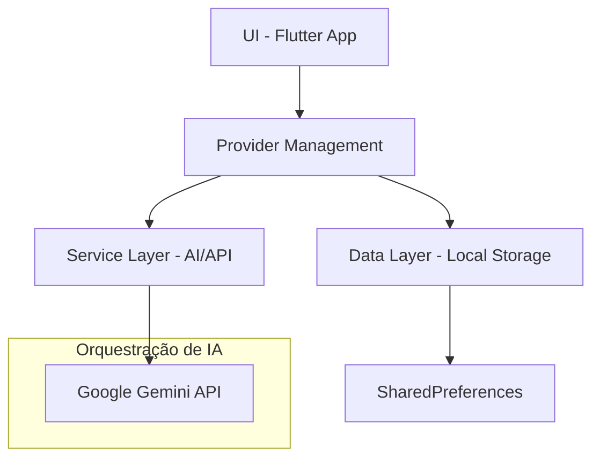

# Calorie Tracker Mobile 🍎

Um aplicativo Flutter nativo para monitoramento de calorias e macronutrientes, orquestrado com Inteligência Artificial (Gemini). Este projeto demonstra a capacidade de integrar modelos de linguagem em escala de dispositivos móveis.

## 🏗️ Arquitetura do Sistema

O projeto utiliza o **Pattern Provider** para gerenciamento de estado e uma arquitetura em camadas para garantir escalabilidade e fácil manutenção.



## ✨ Funcionalidades Principais

- **Deep AI Recognition**: Estimativa inteligente de macronutrientes via reconhecimento de imagem e texto usando Gemini Pro.
- **TDEE Engine**: Cálculo dinâmico de metas calóricas baseado no perfil biométrico do usuário.
- **Persistent Analytics**: Histórico de consumo local com persistência de dados.

---

## 🚀 Segurança e Build (Portfólio)

Este projeto foi desenvolvido com foco em **segurança da informação** e **boas práticas de portfólio**. A chave da API do Gemini nunca é exposta no código-fonte ou no GitHub.

### Configuração da Chave
1. Crie um arquivo chamado `keys.json` na raiz do projeto.
2. Adicione sua chave seguindo este modelo:
   ```json
   {
     "GEMINI_API_KEY": "SUA_CHAVE_AQUI"
   }
   ```

### Como Rodar / Gerar APK Seguro
Para que o app reconheça a chave e proteja o código contra engenharia reversa:

**Desenvolvimento:**
```bash
flutter run --dart-define-from-file=keys.json
```

**Gerar APK para Portfólio (Obfuscado):**
```bash
flutter build apk --obfuscate --split-debug-info=build/app/outputs/symbols --dart-define-from-file=keys.json
```

> [!IMPORTANT]
> O uso do parâmetro `--obfuscate` embaralha o código binário, protegendo a chave da API embutida no APK final.

---

## 🛠️ Tecnologias
- **Flutter & Dart**
- **Provider** (Gerenciamento de Estado)
- **SharedPreferences** (Persistência Local)
- **google_generative_ai** (Integração com Gemini)
